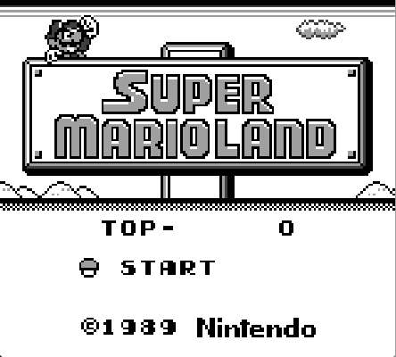
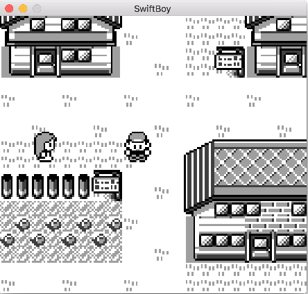
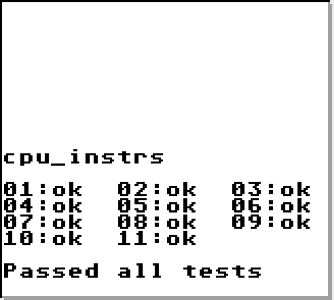
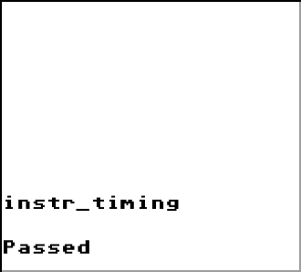

# SwiftBoy
Classic GameBoy emulator project written entirely in Swift. 
 
This project is currently in pre-alpha stage, but recentely reached a major milestone. 

Although most of the emulation is working there are still much more to do. My main focus is now on providing support for all most common cartridge types and improving the UI for the first alpha release. Any feedback is welcomed. You can see how it looks down below:

It even runs Pokemon Blue flawlessly! Checkout this [video](https://www.youtube.com/watch?v=mHkm-G8RO1c).

It still is not ready, as there are some bugs here and there, but it certainly is becoming more and more usefull.

## Features
### What is working
- Bootstrap
- Fast Bootstrap (no bios file required)
- 99% of CPU instructions
- 100% accuracy of CPU instructions (according to Blargg test roms)
- BG, Window and Sprite rendering in PPU
- Interrupts
- Tetris, Super Mario Land, Pokemon Red/Blue, Alladin, and probably many more ;)
- Raw roms (no MBC), MBC1 and MBC3 roms
- Emulation speed synchronization
- Fast OpenGL rendering with v-sync
- New better UI
- Rom loading from popup (File -> Open Rom)

### What is not working
- Sound
- Rest of the memory bank controllers
- STOP instruction
- Some glitches left in PPU
- Serial
- No other games were tested yet
- New UI may be unstable as of right now
- Savestates and ingame saving

## Tests
This emulator is constantly tested using Blargg's GameBoy test roms. Current results can be seen below:

General CPU Instruction test:

CPU Instruction timing test:

## Disclaimer
As this is my first project in Swift it may contain ugly piecies of code, but trust me, I'm working on it.
Main branch should now be stable (no rebases and force pushes), all of the developement is done on the feature branches.
