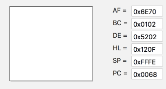

# SwiftEmu
Classic GameBoy emulator project written entirely in Swift. 
 

This project is currently under heavy developement and is not yet ready. 

There is still a lot to do, but this project reached the state of what I call: "Cool, I can see the results of my work". Now it's possible to run through all of the bootstrap instructions, display Nintendo logo and reach the Tetris title screen. You can see how it looks down below:

As this is my first project in Swift it may contain ugly piecies of code, but trust me, I'm working on it.
I currentely decided to push to the master branch, to be able to easily track progress. When this project reaches usable state I will switch to feature branch scheme.
